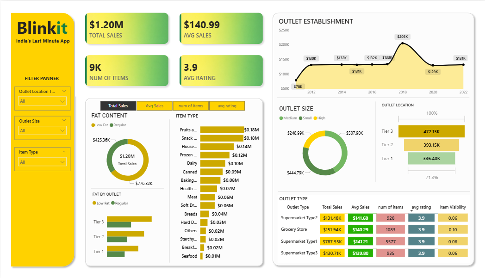

# 🛒 Blinkit Sales Analysis Dashboard

## 📊 Project Overview
This project presents a **Sales Analysis Dashboard for Blinkit – India's Last Minute App**, built using **Power BI**.  
The dashboard analyzes sales performance, item categories, outlet types, and fat content distribution to generate meaningful business insights.

## 🚀 Objectives
- Analyze overall **Blinkit sales performance**
- Understand the impact of **fat content on product sales**
- Identify **top-performing item types**
- Compare **outlet size and outlet location performance**
- Visualize trends using interactive Power BI dashboards

## 🛠 Tools & Technologies
- Power BI
- Data Visualization
- Business Intelligence
- Data Analysis

## 📈 Key Metrics
- **Total Sales:** $1.20M  
- **Average Sales:** $140.99  
- **Number of Items:** 9K  
- **Average Rating:** 3.9  

## 📊 Dashboard Insights

### 1️⃣ Sales by Fat Content
Comparison between **Low Fat** and **Regular** items to understand customer preference.

### 2️⃣ Item Type Analysis
Sales distribution across product categories such as:
- Fruits & Vegetables
- Snack Foods
- Household
- Frozen Foods
- Dairy Products
- Canned Goods
- Meat & Seafood

### 3️⃣ Outlet Establishment Trend
Shows how sales vary depending on the **year the outlet was established**.

### 4️⃣ Outlet Size Analysis
Comparison of sales among:
- Small outlets
- Medium outlets
- Large outlets

### 5️⃣ Outlet Location Analysis
Sales comparison across:
- Tier 1 cities
- Tier 2 cities
- Tier 3 cities

### 6️⃣ Outlet Type Analysis
Performance comparison between:
- Grocery Stores
- Supermarket Type 1
- Supermarket Type 2
- Supermarket Type 3

## 📷 Dashboard Preview

## 📂 Project Files
- `blinkit.pbix` → Power BI Dashboard file  
- `README.md` → Project documentation  

## 📌 Key Insights
- Supermarket Type 1 contributes the highest total sales.
- Tier 3 locations generate the most revenue.
- Medium-sized outlets dominate overall sales.
- Snack foods and fruits & vegetables are among the most popular product categories.

## 👨‍💻 Author
**Gayathri U**  
Aspiring **Data Analyst | Python | Power BI**

⭐ If you like this project, consider giving it a **star on GitHub**.
